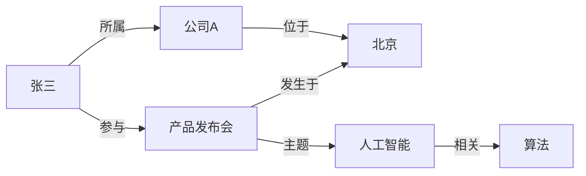

# 知识图谱

## 概述
这是一个示例知识图谱，展示了主要实体、属性和关系。你可以根据实际需求扩展节点、关系和分类。

## 实体节点
- 人物
- 机构
- 地点
- 事件
- 概念

## 关系示例
- `人物` -> `所属机构`
- `人物` -> `参与事件`
- `机构` -> `位于地点`
- `事件` -> `发生于地点`
- `概念` -> `相关概念`

## 例子
- 张三（人物）
- 公司A（机构）
- 北京（地点）
- 产品发布会（事件）
- 人工智能（概念）

## Mermaid 知识图谱示例

## 扩展建议
- 添加更多实体类型，例如 `产品`、`技术`、`法规`
- 定义属性标签，例如 `成立时间`、`职位`、`地点类型`
- 建立实体属性表，支持属性值查询
- 如果需要可视化，使用 Mermaid 或图数据库工具
